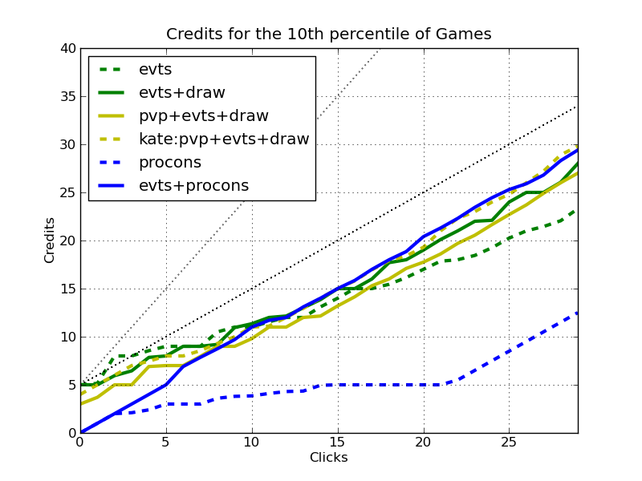

# A Simulation Study of Event-Based Runner Economies in ANR

## *Abstract* 

This article provide a simulation-driven analysis of multiple popular runner economic and draw engines in Android Netrunner (ANR).  We introduce a simulator that considers many salient aspects of the ANR rules, and use it to quantitatively study the click efficiency for card draw and credit generation of different economic packages.  The goal is to provide an additional set of information for consideration in deck design, so that you can choose the proper economic engine for the tempo and timing of your deck.

## Why use a Simulation?

There are many aspects of ANR that we understand relatively well.  Sure Gamble is a good card.  Prepaid Kate is a firm foundation.  Criminal economies can enable constant pressure.  There is a tempo loss for Professional Contacts.  Magnum Opus works well in big-rig decks.  These intuitions are developed from our personal experiences, and from the ANR community at large (bgg, stimhack, netreddit, youtube), and we use these and other considerations when constructing and playing decks.  However, our intuitions are relatively imprecise.  It is difficult to answer questions such as:

- How much of a tempo hit can we expect from Professional Contacts?
- How much better is Prepaid Kate over a normal Prepaid Voice Pad deck?
- How much click efficiency do we get for drawing normally versus drawing with Diesel and Quality Time versus doing the same with an event economy?
- In the worst 10% of my games, what's economic efficiency I can expect?

This article provides the results from a discrete event simulator of the runner economies of ANR that is able to answer these and many other questions.  In future articles, I'll expand beyond event economies.  However, event economies are quite popular, and it is not always clear which to choose for a given deck.  

So our goal is to get some quantitative information that we can use to describe the various runner economies.  Most of these make some trade-offs - for example, ceding tempo for long-term efficiency - that must be matched with the rest of the deck for maximum efficiency.  Simply put, our goal is to understand the various aspects of economic and card-draw efficiency.

## Back to Basics: Credits and Cards

We enjoy seeing the likes of a good Medium dig or a successful Quest Completed.  The basis of all such plays is drawing the necessary breakers and tricks, and the money to install them and fund the runs.  It is not enough to focus on one, without the other.  Many economic packages impact draw efficiency, and vice-versa.  So lets start with a couple of definitions:

**Click efficiency** is the multiplicative factor that cards give you for spending your clicks on getting credits and cards.  Without playing any cards, ANR lets you trade a single click for a single credit or card, so this is the base-line efficiency.  At the high end, we see cards like Magnum Opus that gives us two credits for a single click, or Professional Contacts that gives us both a credit and a draw.  These efficiency multipliers are easy to understand (though the cost of the cards is less-so).  

However, this analysis gets complicated quickly.  What is the efficiency of Sure Gamble?  A click to draw, a click to play, and a net gain of 4 credits = 2 credits per click?  But what if you also include Diesel in your deck that increases the efficiency of your card draw.  Now Sure Gamble is more efficient as it is less than a click to draw it (on average)!  What about Quality Time that is net-zero efficient (one click to draw, one to play, and three credits = 5 clicks for 5 clicks worth of draw)?  It actually becomes more efficient with Sure Gamble as click efficiency for credits is increased, and more efficient with Diesel that increases click efficiency for draw.  And the increased efficiency of Quality Time also increase the efficiency of Sure Gamble and Diesel that both must be drawn.  These complex relationships are what motivate simulation to assess the click efficiency.

**Resource clicks** are those that are used with the intention of gaining more credits or cards.  They do not include actions such as playing a breaker, a piece of hardware, or a resource.  This article investigates only the *resource click efficiency* of various economy and draw packages.

A **Quality Draw** is a draw that results in a card that is not itself devoted to economy or draw.  A non-quality draw is different from the traditional notion of a *dead draw*.  A dead draw is a card that is useless as it was only useful in another part of the game (e.g. Levy AR Access in your starting hand), or is a copy of an already installed program that doesn't stack (e.g. Professional Contacts).  Every dead draw is not a quality draw.  However, there are non-quality draws that are not dead.  A deck that includes *only* economy and draw cards would have no dead draws, but none of them are really useful.  Quality draws, then, are those that allow you to interact with the opposing side, not just play the macro game of credit and draw.

The rest of this article, then, looks at the click efficiency of gaining credits, and the click efficiency of making quality draws for various economic packages.

## Event Economies

Lets look at three prototypical runner economies: 

- **evt** which is based on Sure Gamble, Dirty Laundry, and Lucky Find, and optionally includes a draw package based on Quality Time and Diesel.
- **pvp** which includes both the credit and draw packages from **evt**, along with Prepaid Voice Pad (PVP).  We'll look at both the Kate and non-Kate versions.
- **procons+evt** which includes all of the credit-based events from **evt**, and Professional Contacts for draw.

The event package is commonly seen in many runner decks, the pvp list is the backbone of the famous "Prepaid Kate" decks, and the Professional Contacts deck, though less common competitively, is not uncommon.  The latter is interesting as the tempo hit for playing the 5-cost Professional Contacts is often used as an excuse to avoid this economic engine.  The PVP decks are interesting as it is unclear if PVP is worthwhile outside of Kate, and it is also unclear how much more efficient Prepaid Kate is than the alternatives.

## Credit Click Efficiency

## Draw Click Efficiency

## Consistency

# FAQ

## What's a discrete event simulator (DES)?

A DES quantizes time, in our case, into clicks.  At each click, a set of events that manipulate the state of the hand, board, deck, and credit pool are executed.  An event might add future events (i.e. Earthrise Hotel sets future events for additional draw).  At its core, this is all that a DES is.
## What assumptions are made by the simulator?

We have to make a number of assumptions so that we can get useful information out of the simulator.  These include:

- Hand size is infinite.
- We consider only clicks used for gaining resources.  That is, only clicks that you would normally use to gain credits, or cards.  If you run once per turn, and install a program at about the same rate, then the other two clicks per turn will likely be used for macro (econ and card management).  Thus, there is not a direct correspondance between the click number in the simulation, to the click number in the real game.
- There is currently *no interaction* between runner and corp.  The results of this simulation are meant to provide information to a runner regarding how efficient each click spent on econ/draw is.  This is the largest assumption, but is necessary to simply the game to the level where a simulation provides useful information.
- An ordering, or priority, is assigned to different cards that is used to determine which action to take with any given click.  This ordering is derived from my own experience with playing ANR, and watching others play.

However, there are many non-trivial aspects of the game we do consider:

- Mulligan.
- Starting hard and deck size.
- Decision processes to determine which action to take out of a number of possibilities.
- The rules of many different cards including, for example, Earthrise Hotel, Test Run, SMC, Lucky Find.
