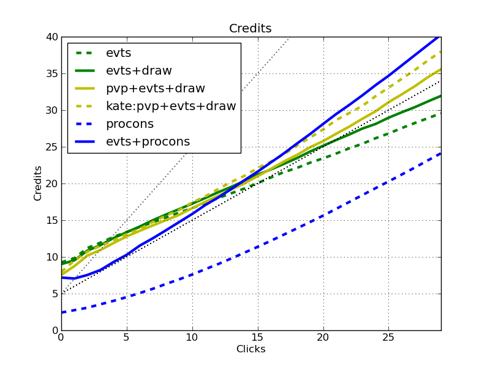

# A Simulation Study of Event-Based Runner Economies in ANR

## *Abstract* 

This article provide a simulation-driven analysis of multiple popular runner economic and draw engines in Android Netrunner (ANR).  We study the click efficiency for card draw and credit generation of different economic packages.  The goal is to provide an additional set of information for consideration in deck design, so that you can choose the proper economic engine for the tempo and timing of your deck.  When should you throw Professional Contacts in your deck?  How much better is Prepaid Kate than normal Prepaid decks?  How much better than normal event decks?  How important are draw cards?  For the answers to this and more, read on.

## Why use a Simulation?

There are many aspects of ANR that we understand relatively well.  Sure Gamble is a good card.  Prepaid Kate is a firm foundation.  Criminal economies can enable constant pressure.  There is a tempo loss for Professional Contacts.  Magnum Opus works well in big-rig decks.  These intuitions are developed from our personal experiences, and from the ANR community at large (bgg, stimhack, netreddit, youtube), and we use these and other considerations when constructing and playing decks.  However, our intuitions are relatively imprecise.  It is difficult to answer questions such as:

- How much of a tempo hit can we expect from Professional Contacts?
- How much better is Prepaid Kate over a normal Prepaid Voice Pad deck?
- How much click efficiency do we get for drawing normally versus drawing with Diesel and Quality Time versus doing the same with an event economy?
- In the worst 10% of my games, what's economic efficiency I can expect?

This article provides the results from a discrete event simulator of the runner economies of ANR that is able to answer these and many other questions.  If you want to know what a discrete event simulator is, or why we're using it, check out the FAQ below.  

In future articles, I'll expand beyond event economies.  However, event economies are quite popular, and it is not always clear which to choose for a given deck.  So our goal is to get some quantitative information that we can use to describe the various runner economies.  Most of these economies make some trade-offs - for example, ceding tempo for long-term efficiency - that must be matched with the the specific requirements of your deck for maximum efficiency.  Simply put, our goal is to understand the various aspects of economic and card-draw efficiency.

## Back to Basics: Credits and Cards

We enjoy seeing the likes of a good Medium dig or a successful Quest Completed.  The basis of all such plays is *drawing* the necessary breakers and tricks, and the *credits* to install them and fund the runs.  There are many great articles that focus on the breakers and tricks parts of decks.  This will focus entirely on the credit and draw aspect.  It is not enough to focus on either draw or credits, without the other as most cards impact both.  Many economic packages impact draw efficiency, and vice-versa.  More importantly, we'll see that most traditional economic engines trade one for the other.  Lets start with a couple of definitions:

**Click efficiency** is the multiplicative factor that cards give you for spending your clicks on getting credits and cards.  Without playing any cards, ANR lets you trade a single click for a single credit or card, so this is the base-line efficiency.  At the high end, we see cards like Magnum Opus that gives us two credits for a single click, or Professional Contacts that gives us both a credit and a draw.  These efficiency multipliers are easy to understand (though the up-front cost of the cards is less-so).  

However, this analysis gets complicated quickly.  What is the efficiency of Sure Gamble?  A click to draw, a click to play, and a net gain of 4 credits = 2 credits per click?  But what if you also include Diesel in your deck that increases the efficiency of your card draw.  Now Sure Gamble is more efficient as it is less than a click to draw it (on average)!  What about Quality Time that is net-zero efficient (one click to draw, one to play, and three credits = 5 clicks for 5 clicks worth of draw)?  It actually becomes more efficient with Sure Gamble as click efficiency for credits is increased, and more efficient with Diesel that increases click efficiency for draw.  And the increased efficiency of Quality Time also increase the efficiency of Sure Gamble and Diesel that both must be drawn.  These complex relationships are what motivate simulation to assess the click efficiency.

**Resource clicks** are those that are used with the intention of gaining more credits or cards.  They do not include actions such as playing a breaker, a piece of hardware, or a resource.  This article investigates only the *resource click efficiency* of various economy and draw packages.  This is a strange definition and a little difficult to wrap your head around.  The intuition is that if you're playing and think "I need cards", or "I need credits", and you choose the path that gets you that, you're spending a resource click.  Note that for many event economies, the answer is often the same:  if you have a economy card, play it.  Otherwise draw.  The efficiency of a resource click will *on average* yield you a number of credits, and a number of draws.  The "on average" part is important to understand.  You may draw during a game, which obviously gets you no credits.  However over the course of a game, the average credits for such a resource click will also consider playing Sure Gambles.  Thus, on average, you're getting some amount of credits, and some amount of cards.

A **Quality Draw** is a draw that results in a card that is not itself devoted to economy or draw.  A non-quality draw is different from the traditional notion of a *dead draw*.  A dead draw is a card that is useless as it was only useful in another part of the game (e.g. Levy AR Access in your starting hand), or is a copy of an already installed program that doesn't stack (e.g. Professional Contacts).  Every dead draw is not a quality draw.  However, there are non-quality draws that are not dead.  A deck that includes *only* economy and draw cards would have no dead draws, but none of them are really useful.  Quality draws, then, are those that allow you to interact with the opposing side, not just play the macro game of credit and draw.

Given these definitions, the rest of this article, looks at the **resource click efficiency of gaining both credits and quality draws** for various economic packages.

## Event Economies

Lets look at three prototypical runner economies.  The **bold** labels designate the lines within the graphs.

- **evt** which is based on Sure Gamble, Dirty Laundry, and Lucky Find.
- **draw** includes a draw package based on Quality Time and Diesel.  Card advantage isn't as important in ANR as in MTG, but it will impact our ability to find our next event that provides credits!
- **pvp** which includes both the credit and draw packages from **evt** and **draw**, along with Prepaid Voice Pad (PVP).  We'll look at both the Kate and non-Kate versions.
- **procons** which includes Professional Contacts.

The event package is commonly seen in many runner decks.  The pvp list is the backbone of the famous "Prepaid Kate" decks.  These decks are interesting as it is unclear if PVP is worthwhile outside of Kate, and it is also unclear how much more efficient Prepaid Kate is than the alternatives.  The Professional Contacts deck, though less common competitively, is not uncommon on NetrunnerDB.  The tempo hit for playing the 5-cost Professional Contacts is often used as an excuse to avoid this economic engine.  Lets see the impact of that!

We use simple mulligan strategies:  the Professional Contacts-based packages mulligan for **procons**, and the others mulligan for either Sure Gamble or Lucky Find.  Obviously, mulligan decisions in a real game are more complicated than this.  In a later article, we'll investigate the impact of mulligan strategies on click efficiency.

## Credit Click Efficiency

First, lets check out credit click efficiency.  In the following graphs, X-axis is the increasing number of resource clicks, and the Y-axis is the number of credits accumulated.  There are two straight dotted lines.  One represents just clicking for money (slope of 1, starting at 5 credits), and the other has a slope of 2, and is useful for reference.  We run 1024 simulated games, and these graphs report the average credits gained over a number of resource clicks.

**Discussion.** 

- First, lets discuss the outlier.  **procons** on its own is pretty bad.  Though it gets close to a slope of one eventually, it is offset downward from the other curves by about 10 credits.  Indeed, **procons** can impose a *huge* tempo hit.  
- **procons+evt**, however, is significantly better.  Though you can see a tempo hit versus the other approaches for the first five clicks, after that it has the steepest slope!  The events smooth over the one-time hit from installing **procons**, lessening the tempo hit.  If you have a deck that is willing to get rolling a little slower (a large possibility once Clot forces the meta to change), this offers the highest credit/click ratio for the long game.
- **evt** and **evt+draw** start the strongest as they have almost no "infrastructure" costs that cause tempo loss.  However, their click efficiency over time is inferior (less than 1 click per credit!).  The *draw* cards increase the *credit* click efficiency of the deck as they put more credit events into your hand more efficiently.  If you have an extremely aggressive deck that needs money very quickly, this package might be appropriate.
- The **pvp** decks are a little bit of an aberration.  They *increase* in efficiency as time goes on (i.e. the slope increases with more resource clicks).  Prepaid Kate has a well-deserved reputation, but the normal **pvp** deck does quite well, and is consistently better than getting one click per credit.  Note that another aspect of **pvp** decks is that other events are comparably discounted which isn't considered here.

Next, we can explicitly look at the slope of the lines to determine click efficiency.  Now the Y-axis is simply the number of credits received per click.  This is just another representation of the same data.

**Discussion.** This reinforces the previous conclusions.  The event decks start out very fast as they play any credit-gaining events in their starting hands (without having to draw any cards yet).  However, when they have to dig for economy cards, their efficiency goes down.  The **pvp** decks only out-perform clicking for a credit after 15 resource clicks, while the **evt+procons** deck suffers a tempo hit at the start, but then powers into significant efficiency.  By the end, efficiency is topping out at around 1.4 credits per click.  Note that the **procons** decks increase in efficiency as the clicks go on due to variance in if we drew Professional Contacts early or not.

This last point seems a little suspect.  If the variance of an economic package including **procons** has such an impact on its *average* efficiency, does that mean that it will under-perform in a competitive environment where consistency is key?  Yes and no.  Lets look at the credits you'd get in that 1 out of 10 game where everything goes wrong.  The following graph takes the lower-bound on the credit value that you'd see 9 times out of 10.  1 out of 10 times, you might see worse.  There is a subtlety here:  there is no "10% game".  Instead, we took the 10% worst credit value across all games for each click number.  So any given game - even one of the worst - might be worse than this curve for some clicks, but not for others.  However, it does give us a sense for how bad the bad draws are for the various economic packages.

**Discussion.**  We can see that **procons+evt** is still the most efficient in the long game, but in this case, there is quite a tempo hit (taking about 7 resource clicks to catch up from).  Overall, many of the approaches are still relatively efficient, but they take some time to get rolling.

Lets take a step back for a second.  These results are a little distressing.  Are we saying that *we put all of these economy cards into our decks, and the result is often not even as efficient as clicking for credits?*!?  Insanity!

Yes, yes we are.  But that's only half the story.  The other half is quality draw efficiency.  While clicking for credits might do better than **evt**, it would yield no cards, thus no options.  So to round out the story, we must also look at quality draw efficiency.

## Quality Draw Efficiency

So how many quality draws per resource click do each of the economic packages yield?  In the following graph, the dotted line has a slope of one, again for reference.  If we just clicked to draw, that line would result.

**Discussion.**
- **procons** interestingly comes out at the top of the bunch.  This is because except for **procons** draw and the click to play the Professional Contacts, every click is spent either on drawing, or on clicking **procons**.  The main reason the efficiency is slightly less than one is due to dead draws of the subsequent Professional Contacts.
- **evts+procons** demonstrates the lowest efficiency, in contrast to the credit efficiency graphs.  This is due to three factors:  first, the Professional Contacts dead draws; second, drawing the subsequent economic events decrease draw quality; third, the draw power of **procons** is less than the draw events.
- The draw efficiency of **evts** is slowed down by 1) drawing economy events, and 2) playing them to gain credits.  **evts+draw** has more quality draw efficiency.  This answers the question, "how much of an impact will adding card draw into my deck have"?
- *pvp* decks (the lines are overlapped) have decreased quality draw efficiency due to the clicks to draw the Prepaid Voice Pads, and the clicks to play them.  Though they accelerate the credit efficiency, they degrade draw efficiency.

The next graph emphasizes the click efficiency for quality draws.  All the **draw** decks show a boost at low click numbers due to draw cards in the starting hand, and then settle into a steady-state efficiency.  Spoiler:  Andromeda is good.

## Implications for Deck Building

The results point to three significant dimensions that impact which credit and draw package is best for different strategies.

1. How important are the first five resource clicks for your deck?  Typical Gabe decks cannot wait for the tempo hit that **evt+procons** imposes.
2. How important is quality draw efficiency?  The difference between **evts+procons** and **evts+draw** is about a 33% increase in draw efficiency?  The **pvp** deck's quality draw efficiency are in-between the other two.  
3. How important are mid- and late-game credits?  The efficiency of **evts+procons** is exceptional (75% greater than **evts+draw**).

*Simple conclusions:* 
- Is early game econ required?  Don't use **procons** decks.  If you can burn around 4-5 resource clicks, it becomes a monster.  If you can't, it isn't the econ package for you.
- Never use a deck that relies *only* on **procons**.  As expected, consistency is an issue.
- High draw efficiency, and decent credit economy = **evt+draw**.
- Decent draw, and high(est) credit efficiency = **procons+evts**.
- Medium-level draw and medium-level click efficiency = **pvp+evts+draw**.

# FAQ

## What's a discrete event simulator (DES)?

A DES quantizes time, and executes a sequence of events at each time.  In our case, we quantize the system in into resource clicks.  At each click, a set of events that manipulate the state of the hand, board, deck, and credit pool are executed.  An event might add future events (i.e. Earthrise Hotel sets future events for additional draw).  At its core, this is all that a DES is.

## Why a simulator?

Lets use the Sure Gamble example from before.  How many clicks does it cost in total?  The naive analysis is 1 to play, and 1 to draw.  But throw a Quality Time in the deck and it all changes.  Lets restate the Sure Gamble and Quality Time click costs (CC):

`CC(SureGamble) = 5CE + DE + 1`

`CC(QualityTime) = 3CE + DE + 1`

where `CE` is the credit efficiency and `DE` is the draw efficiency (note, *not* the quality draw efficiency as we don't want to ignore drawing the Sure Gamble).  The "`+ 1`" in both cases is the play click which isn't compressed (until we get Hayley).  Now what's the `CE` and `DE`?

`CE = f(CC(SureGamble))`

`DE = g(CC(QualityTime))`

There are two functions, `f` and `g` that determine the efficiencies *based on the click costs of the economy and draw cards*.  Lets ignore for now what `f` and `g` actually are (a previous simulator attempted to define them...and failed in a sea of complexity).  Lets just point out that `CC` is dependent on `DE` and `CE`, while both `DE` and `CE` are dependent on `CC`.  This recursive relationship will likely converge, but finding a strict fixed point is quite complicated.  Determining it analyitically (i.e. with only math) is unlikely to be reasonably feasible.

Now factor in the odd rules of many cards in ANR (Test Run for Magnum Opus), and you realize that simply throwing math at the problem won't be sufficient.

Thus, we use a discrete event simulator.

## What assumptions are made by the simulator?

We have to make a number of assumptions so that we can get useful information out of the simulator.  These include:

- Hand size is infinite.
- We consider resource clicks.  Thus, there isn't a direct correspondence between clicks in a game, and the clicks displayed in the graphs.
- The big one: there is currently *no interaction* between runner and corp.  The results of this simulation are meant to provide information to a runner regarding how efficient each click spent on econ/draw is.  This is the largest assumption, but is necessary to simply the game to the level where a simulation provides useful information.
- An ordering, or priority, is assigned to different cards that is used to determine which action to take with any given click.  This ordering is derived from my own experience with playing ANR, and watching others play.

However, there are many non-trivial aspects of the game we do consider:

- Mulligan.
- Starting hard and deck size.
- Decision processes to determine which action to take out of a number of possibilities.
- The rules of many different cards including, for example, Earthrise Hotel, Test Run, SMC, Lucky Find.
