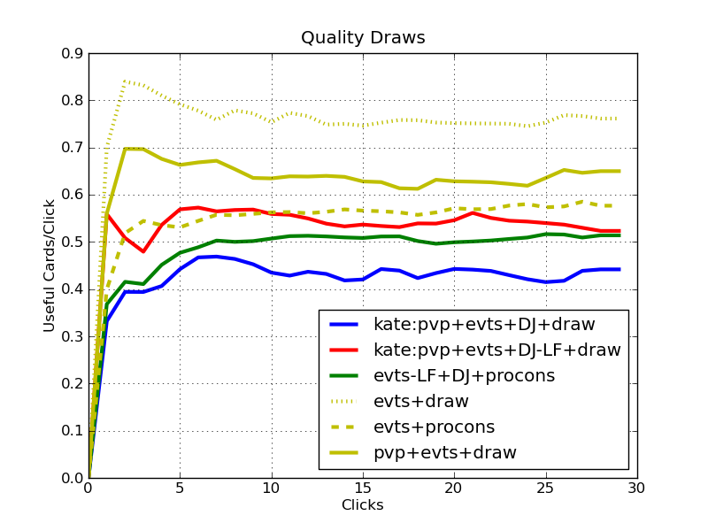

# Analysis of a Changing Meta

The meta of runner economies is always in flux.  What does it mean quantitatively to shake up the meta?  Will cards on the horizon shake up the meta?  First we look at the past:  why did Lucky Find create such a stable and lasting enconomic engine in Prepaid Kate.  Second, we'll check out the cards that recently came out, or are coming out in Order and Chaos, and see if a similar disturbance in the meta will be created.  The summary:

Card | Credit Efficiency | Draw Efficiency | Meta Impact
-----|-------------------|-----------------|------------
Lucky Find | +0.4 | -0.2 | Created Prepaid Kate
Day Job | +0.2 | -0.2 | 1) beast-mode econ, and 2) LF replacement

## *Abstract*

How does one economic engine fall out of favor in the meta, and how does another come to prominence?  In this installment of ANR analysis of runner economies, I'm going to look at how previous changes in the card pool impacted the meta, and I'll look forward to determine how the meta will change when Order and Chaos drops.  Importantly, I'll assess each economic engine's trade-offs between draws and credits.  This is a quantitative analysis, and must be pared with a qualitative analysis to determine if any given economic package is for your deck.  If you have no interest in the investigation and analysis, skip to the conclusions.

## Beware:  Assumptions Ahead

Any simulation of sufficiently complex systems is based on a model of the system.  That model is not perfectly accurate.  For a list of assumptions, please see the first article.  A few responses to that article pointed out a few additional assumptions.  The main addition one is that I'm assuming that dirty laundry uses a resource click.  This is obviously wrong if you have access to a server and want an access.  So take this with a grain of salt.  This information must be paired with your intuition, and other sources to determine what's best for your deck - it is only an additional input into the netrunner collective consciousness, not the final word.

This article isn't an analysis of every economic engine, and this one, like the first, focuses on the Shaper economy as it is, in many ways, the easiest to understand.  To run an experiment, we have to tweak a small number of free variables, thus we're taking this a small step at a time.  If you want to skip to the punchline comparing all econs, you'll have to wait a while.  Future articles will delve further into a variety of econs.  The next will look specifically at new Anarch event-based econ options.

## The Rise of an Economic Engine

I remember seeing the first Prepaid Voice Pad (PVP) decks on netrunnerdb, and appreciating the synergy.  At that time, they were a mishmash of previous Kate decks with significantly less of an emphasis on a balance between events and traditional Shaper goodness than the current prominent decks.  What was the key to the Prepaid economic revolution that made this deck prototype competitive?  PVP had been out for a while, as had most of the moving pieces.  However, when Lucky Find came out, it provided the third major form of event economy that made the Prepaids tick.  We know (historically) that the meta shifted significantly when Lucky Find appeared, so lets look at the underlying efficiency changes that motivated this change.  This will let us quantify and better understand when these shifts in the meta happen.

For the details about what we're plotting here, please see my [previous article](../01_legacy_evt_econs/article.md) on the analysis of the event economic engines in ANR.  Notably, you must understand what I mean by "resource clicks", "quality draws", and "credit/draw efficiency".  Quoting from the previous article, "this article looks at the **resource click efficiency of gaining both credits and quality draws** for various economic packages".  If this doesn't make sense, please check out the first article.

The amount of credits generated (y-axis) for of prepaid decks both with and without Lucky Finds is shown here over a number of resource clicks (x-axis).  The lines represent the following economic packages:

- **evts** is Sure Gamble, Dirty Laundry, and Lucky Find.
- **draw** is Diesel and Quality Time.
- **pvp** is Prepaid Voice Pad, and here we look at Kate who gets the PVP for cheap.  In the previous article, we compared this versus non-Kate PVP.
- **oldevts** is Sure Gamble and Dirty Laundry.  An age before the finds were lucky!

**Discussion.**

- **pvp** adds efficiency to both the old and the new economic engines.  Interestingly, it adds more efficiency to the inferior economic package as PVP plays a larger role in the economy received (for example, it helps Dirty Laundry more than Lucky Find).  It still has a relatively small tempo hit.
- Using Lucky Find has a huge impact on the economic efficiency both with and without PVP.  It has an offset of at least 3 credits, and has a significant slope increase (i.e. efficiency increase).  Each click provides 0.4 clicks per draw more, a huge increase!

Looking at the data another way, here is a direct representation of the click efficiency (i.e. the derivative of the curve):

We see again that **pvp** helps increase efficiency, but that Lucky Find really does offer a huge increase in credit efficiency.  Lets look at draw:

**Discussion.**

- Regardless if PVPs are used, Lucky Find seems to decrease quality draw efficiency by 0.2 quality draws per click.  This is due to the draw plus two clicks to play for each Lucky find.  However, this quality draw decrease compared to the 0.4 credits per click increase that Lucky Find provides is not prohibitive.
- Note that the fall off at the end of the **oldevts+draw** is due to running out of cards.

So what does a change in the economic meta look like?  We know that a 0.4 credits per resource click increase, accompanied by a 0.2 quality draws per resource click will do the trick.  We also know that it is often worth the 6 influence cost, an otherwise significant cost.

## A Disturbance in the Meta

Though a few key cards are coming (or recently dropped) concerning card draw, I'm interested here in understanding how Day Job is going to impact the meta.  Will it redefine the Prepaid VoicePad runner event economy compositions?  Will it fall at the way-side due to insufficient efficiency?  Or will its card art make it tier one, independent of any other factor?

Additionally, we recently saw the drop of influence-free draw in the form of the Earthrise Hotel.  Many have speculated that it has a place in many decks.  Within PVP, with Shaper draw cards, it seems unlikely to be needed.  Lets confirm or refute this hypothesis.  The following graphs include:

- **DJ** when they include Day Job.
- **EH** when they include Earthrise Hotel.
- **procons** includes Professional Contacts.  

The **evts+procons** and **evts+draw** decks are a baseline you can use for comparison with the previous article.  They represent interesting trade-offs between credit and quality draw efficiency.

**Discussion.**
- Adding Earthrise Hotel does not do good things for credit resource click efficiency.  It causes a constant shift of the curve downwards due to its high cost.
- On the other hand, Day Job has a huge impact.
- Neither is as efficient as the Professional Contacts deck, but it should be pointed out that the **procons** deck doesn't reach the credit level gain by 30 resource clicks of the Day Job deck.  Sure, it may be more efficient click-for-click, but the tempo hit makes it less efficient in absolute terms.

Another view of the same, focusing on credit click efficiency.

**Discussion.**
- Earthrise Hotel has a tempo hit, and we can see the Earthrise Hotel + draw trails off at the end.  This is because the entire deck is drawn.  A great point is that we probably don't want Quality Time and Earthrise Hotel in the same deck.  I'll look at other impacts of Earthrise in other decks in this and subsequent articles.
- Day Job has a large impact on credit click efficiency.  Unlike Lucky find which had a 0.4 credit/click increase in efficiency, Day Job has about a 0.3 credit/click increase.  Most remarkably, it practically seems to do better than the **procons+evt** deck that dominated in terms of credit efficiency in the previous analysis.  We'll see how PVP impacts Day Job soon.

How do Day Job and Earthrise Hotel impact quality card draw efficiency?  Lets see!

**Discussion.**
- Earthrise Hotel significantly increases card draw by between 0.3 cards/click (with Day Job) and 0.4 cards/click (without Day Job).
- Day Job significantly deteriorates quality draw efficiency by a comparable amount to how much Earthrise Hotel increases it.
- All approaches draw more than **procons+evt**.  This is actually pretty significant:  whereas previous economies could not approach the click efficiency of **evt+procons**, we finally have an engine that is better for both credits *and* quality draws!

So far, it seems like Day Job is going to make a splash, and it is unclear how much of an impact Earthrise will have.  Note that, for the sake of the simulation, we assume two resource clicks each turn.  Thus Earthrise is yielding two cards every two clicks within the graphs.  I believe this is reasonable as drawing two cards places some pressure on the runner to play two, or play one and run.

## Future Economic Engines

So once O&C hits, how will it change established economic engines?  I'll defer the question of if it will create new economic engines to the next article, and continue the focus on Prepaid Kate.  I know, my Shaper bias is showing through.

Lets compare three new economic packages to existing ones.  First, lets simply add Day Job to a Prepaid Kate deck.  Second, any Kate deck that can add a free Imp is pretty happy, so lets see what cutting the two influence Lucky Finds, and replacing them with the one influence Day Jobs.  Third, lets check out a similar replacement strategy for **procons** decks.  In the following graphs, the existing economies are the yellow lines.

**Discussion.**
- The traditional Prepaid Kate economy is nearly identical to the one where Lucky Find is replaced with Day Job.  It looks like Kate just got 3 more influence to play with.  O&C has improved Kate decks!  It seems that Anarchs are again gifting other factions will goodies.
- Add Day Job (for a total of 9 influence) to an existing Prepaid Kate deck creates an economic monster.
- Day Job seems like a great Lucky Find replacement in terms of credit efficiency when influence is short in **procons** decks as well.

The click efficiency-centric representation:

**Discussion.**
- We see three distinct clusters.  Again, with the Lucky Find Prepaid deck clustering with the Day Job Prepaid deck, and both **procons** decks also clustering together.  The only downside is that it has a slight tempo hit during the initial clicks.
- The efficiency of the Lucky Find + Day Job Prepaid economy matches the efficiency of the Professional Contacts deck!  This, while being positively offset above the **procons** deck (previous graph) by at least 5 credits.
- A downside worth mentioning of the Lucky Find + Day Job deck, in addition to the influence expenditure, is the number of card slots devoted to economy: 21 whopping cards!

Lets check out quality draw efficiency.

**Discussion.**
- Now we see the downside of Day Job.  All three decks that don't use Day Job have higher quality draw efficiencies.
- The Day Job versions of the existing decks seem offset down by around 0.2 quality draws per click.  Note, we've seen this value before when investigating why Prepaid Kate with Lucky Find came into the meta, so I don't think this downside is debilitating.
- Offset the lowest is the economy based on both Lucky find and Day Job.  We spend a large number of clicks on economy, at the expense of draw.

I'll restate that this is a simple quantitative analysis on click efficiency.  There will certainly be some Kate decks that don't want to cede all pressure for a turn to hit the 'ol Day Job.  Such qualitative constraints must be balanced with the quantitative analysis provided here.

## Conclusions and Guidance for Deck Building

We've investigated a previous shift in the meta when Lucky Find was released, and have analyzed a shake-up in the meta that, given this analysis, seems likely when Day Job hits with O&C.  The judgment is still pending on Earthrise Hotel, and we'll investigate that in future articles.  What have we concluded?

1. When Lucky Find hit, it represented a 0.4 increase in credit efficiency and a 0.2 decrease in quality draw efficiency.  This was enough to motivate a new runner economy based on Prepaid Voice Pad.
2. We've recently been gifted Earthrise Hotel.  It has a significant tempo hit, but it does increase quality draw efficiently significantly.  It might be appropriate for slower decks.  I'll hypothesize at this point that it is mainly useful due to its lack of influence, and we'll investigate its role in Anarch economies in future articles.
3. Day Job is a beast.  It actually generates economic engines that are more efficient than decks with Professional Contacts with credit-gain events.  Generally, it increases credit efficiency by between 0.2 and 0.3 credits per click.  However, it comes at a draw cost of around 0.2 quality draws per click due to the four draw-less clicks it requires.  
4. Day Job can replace Lucky Find in both Prepaid and ProCons decks.  In such cases, the credit efficiency is relatively unchanged, but the gain in influence is paid for in quality draw efficiency (around 0.2 quality draws per click less).
5. Comparing Day Job to when Lucky Find hit the meta, we see that its impact is a little more nuanced.  It doesn't represent the credit per click efficiency increase that Lucky Find did.  However, the increase it does provide is over *an already amazing economic engine*.  Runners are being given beast-mode economies.  The trade-off is in quality draw efficiency which is negatively offset by 0.1 to 0.2 quality draws per click.  An intriguing possibility is to replace Lucky Finds with Day Jobs to gain three influence.  Credit efficiency increases, while quality draw efficiency is somewhat negatively offset.  This effectively trades influence for draw efficiency, which might be appropriate in some decks (i.e. those with many tutors...otherwise known as Prepaid Kate).

That's it for this installment.  The next installment will investigate all aspects of the newly forming Anarch economies.  No longer will Anarchs be credit and draw starved!

## Improvements for the Future

I've received a great many suggestions for how to improve the analysis in the future.  Most good answers start with questions, and these include:

- How can we take tempo and opportunity cost into account?  The cost of event cards doesn't impact the curves if they never go below the event's cost.  In the event economies, if we never go below 5 credits, then we never see the downside of Sure Gamble's cost.
- Is there a way to investigate "quality credits" in addition to quality draws?  This is related to the previous question and might factor into the credit curve the cost of cards.
- What about programs?  How does playing them impact this analysis?
- Can we study consistency as a whole?
- What about my economic package of X, Y, and Z?
 
I believe that all of these considerations can be taken into account.  For the time being, I'm looking at the simpler questions (that there isn't a preexisting answer to), and with time, I'll develop the software to consider more of the depths of the game.  To state it in another way, I'm constantly look at a way to increase the complexity of the model of the game, while keeping the simulation tractable.  Please keep the suggestions coming.
