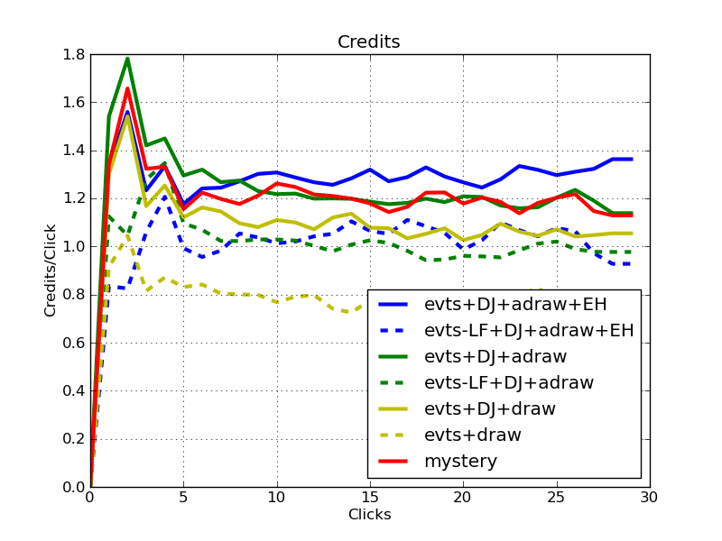
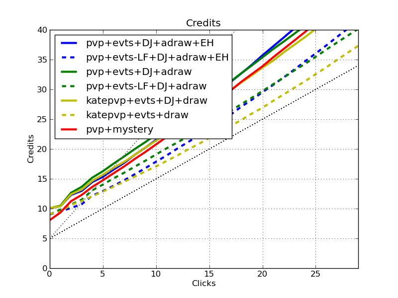
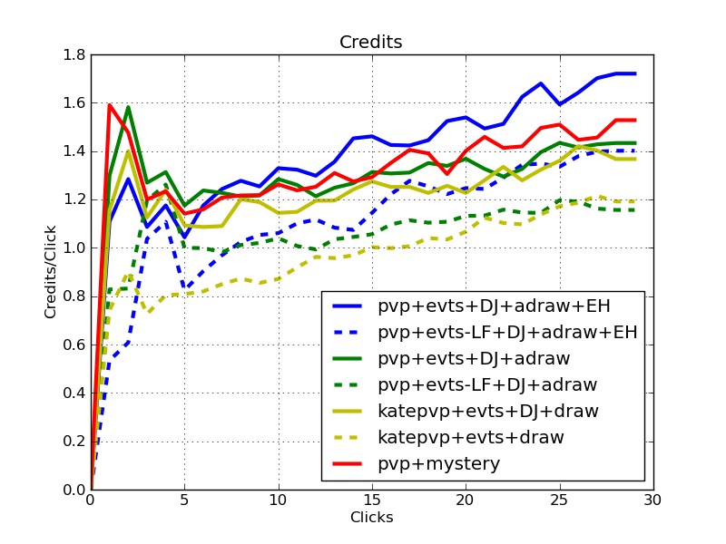

# The Next Generation of Anarch Event-Based Economies

Order and Chaos is going to change things.  Anarch econs are *strong*.  The following are the efficiency changes versus a traditional economic package of Dirty Laundry, Sure Gamble, Lucky Find, Diesel, and Quality Time.  

Economy | Credits/click | Quality draws/click | Compared to
--------|---------------|---------------------|------------
SG+DL+LF+DJ+SS+INJ | +0.5 | -0.4 | Shaper Events: SG+DL+LF+Diesel+QT
SG+DL+DJ+SS+INJ | +0.2 | -0.3 | Shaper Events
SG+DL+LF+DJ+SS+INJ+PVP | +0.3 | -0.3 | Prepaid Kate Events

Anarchs are getting an economic engine that rivals powerful current economic engines.  Can they pay the decrease in draw, and the tempo hit of having a Day Job?

- SG = Sure Gamble
- DL = Dirty Laundry
- LF = Lucky Find
- DJ = Day Job
- SS = Steelskin
- INJ = Inject
- PVP = Prepaid Voice Pad
- QT = Quality Time

## *Abstract*

With the new card draw in the form of Steelskin and Inject, and a new event for credit generation in Day Job, the Anarchs are looking to cast off their traditional weaknesses: draw and economy.  Does this add up to an economic powerhouse, or does it track the Anarch history of lagging behind?

Quoting from the first article, "this article looks at the **resource click efficiency of gaining both credits and quality draws** for various economic packages".  If this doesn't make sense, please check out the first article.

## A Warning

When reading this article, you have to be particularly aware of the weaknesses of the simulation.  A large downside to Day Job is the four click cost.  Though I'm often happy to "click for eight" with Opus, I'm not sure Anarchs should be quite as willing to do the same.  Additionally, we'll see that Inject is a crazy card.  From an economic standpoint, it is.  You draw efficiently, or you get money.  When you get money, it is "free" from an economic perspective in the sense that you aren't discarding any of your econ cards (they're all hardware - PVP - and events).  For an event economy, and from the perspective of drawing and getting credits, Inject is insane.  However, this analysis ignores the realistic downsides to discarding the programs.

Long story short, please be wary when reading this.  Understand that we are assessing the economic potential of the new Anarch econs.  However, they are anarchistic, and their downsides are difficult to analyze here.  As always, use this as one of the many sources of information you use when assessing how good cards are for your deck.

## The New Anarch Economies

Four cards will have a significant impact on Anarch economies (credits *and* draw) come Order and Chaos (O&C).

- Inject (INJ)
- Steelskin (SS)
- Day Job (DJ)

These paired with the existing event economies and resources can be quite powerful.  Existing cards include:

- Sure Gamble (SG)
- Dirty Laundry (DL)
- Lucky Find (LF)
- Earthrise Hotel (EH)

We have invested in previous articles the difficult trade-off that each economic engine makes when trading credit efficiency for draw efficiency.  Day Job is a perfect example of this.  The clicks spent doing Day Job are quite efficient in terms of credits.  However, they are clicks that provided zero draw.  Diesel is the opposite.  Inject is bonkers because it is both.

In the following graphs, the Red line is a mystery line.  It is an economy that makes a decent trade between credit and quality draw efficiency.

Lets look at some combinations of these cards and compare them to traditional event economies.  In the following graphs, the old economic engines are in Yellow.  

- **evts** = SG+DL+LF
- **draw** = QT+Diesel
- **adraw** = SS+INJ

First credit generation:

Second, focus on click efficiency for credits:

Third, draw efficiency:

*Discussion.*

- The solid Green and solid Yellow lines are telling an interesting story.  The economic packages are the same, except that the draw uses Anarch cards, instead of shaper cards.  Inject does work.  It alone makes the anarch economies yield 0.1 credit per click more!  However, as Steelskin is not quality draw compared to Quality Time, the draw efficiency takes a 0.15 quality draw/click hit.
- Earthrise Hotel helps with this issue to some degree by further increasing credit efficiency, and also helping draws.  It might be reasonable to replace EH with QT if you have the influence, but there is a hidden advantage to a cost of four credits:  If the credits/click efficiency of the deck is high, those four credits are cheaper in terms of clicks.  We see this, as the stronger credit economy (with LF) gets more of a benefit from EH.
- The Blue dotted line and Yellow also tell an interesting story.  Their credit click efficiency, and quality draw efficiency are quite similar.  The only downside to the anarch version is the credit hit at the beginning for not having LF in the deck.  An anarch econ that is *influence-free* based on SG, DL, DJ, SS, INJ, and EH is competitive with an already powerful economic engine further augmented with DJ (note, that package in shaper would be 9 influence!).
- Throwing all the tricks in, we have an anarch economy that can gain more than 1.3 credits per click, with the downside of only getting ~0.5 quality draws per click.

## Add Prepaid, get Efficiency

Now lets add Prepaid Voice Pads (PVP) into the mix.  We know that Prepaid Kate is amazing.  How does she compare to these Anarch economies?

First credit generation:

Second, focus on click efficiency for credits:

Third, draw efficiency:

**Discussion.**

- As it turns out, you throw PVP in with a bunch of events, and out pops some pretty amazing economic engines.  The efficiency of the blue line is truly amazing for credit generation, topping out at 1.7 credits per click.  Unfortunately, we can see that the draw is pretty weak, floating around 0.35 quality draws per click.  Note that this is getting to be due to the fact that there are so many econ cards in the deck, that it is hard to find a quality draw.
- The economic package that uses EH for draw, but drops LF actually does pretty great.  It is a little slower to get going, but is competitive with the PVP Kate (+DJ) economy.  That's quite an about-face for Anarch that now have a brilliant *influence-free* package that yields fantastic credit, and good quality draw potential.

## What's the Mystery Econ Package?

Heavy influence:  LF + SG + DJ + SS + INJ + QT.  We drop the Dirty Laundries to increase the quality draw, and import Quality Time to also increase both draw efficiency and synergy with the PVPs.

## An Implicit Cost

A cost to these economic packages is one that I haven't emphasized much:  many event econs require quite a few cards.  Many people want to avoid playing upwards of 18 or more economy cards in their deck.  Event econ decks are not for everyone, and not for every deck.  I discuss the quantitative implications of this by investigating quality draw efficiency.  However, this is one of the areas that your own qualitative reasoning will have to be used.  In future articles, we'll discuss other economic engines beyond event-based economy.
